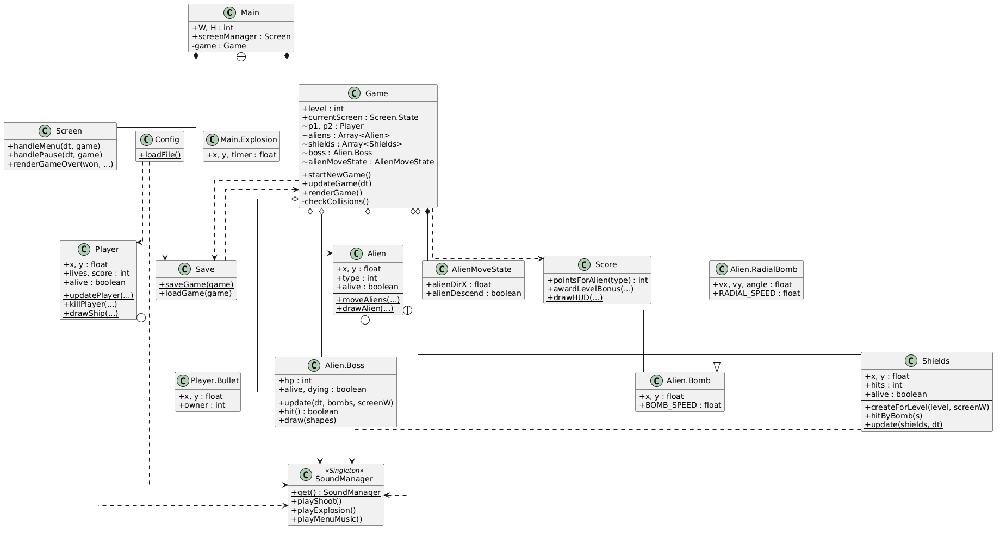

# Java Invaders — Project Report

**Group:**

Larissa Rocha Gonçalves - 15522431

Vinícius de Sá Ferreira - 15491650

---

## 1. Requirements

### Required features (from the assignment)

- Main menu with New Game, Load Game, and Exit options.
- Screen state manager to transition between menus and gameplay.
- Two players sharing the screen with separate keyboard controls.
- Players move left/right and fire projectiles upward.
- Alien formation moves sideways and drops bombs periodically.
- Collision detection: bullets destroy aliens; bombs and alien bodies destroy players.
- At least 3 levels with increasing difficulty.
- Level Complete screen between levels.
- Points per alien kill plus a bonus on level completion.
- Each player starts with 3 lives; game ends when all lives are lost.
- Real-time score and lives displayed on the HUD.
- Save game state (level, scores, lives) to a file.
- Load a previously saved game from the main menu.

### Additional requirements (implementation-specific)

- A boss enemy appears on level 3 after all regular aliens are cleared. It enters from the top, patrols horizontally, bobs vertically and fires radial burst patterns.
- Boss has a multi-phase death sequence: hit-flash, shake, freeze as a white silhouette, then a series of staggered offset explosions before the level ends.
- Music switches automatically between menu, gameplay and boss tracks; each track falls back to procedural PCM synthesis if no asset file is found.
- All sound effects are generated procedurally at startup — no audio asset files are required to run the game.
- A `config.json` file can override most numeric constants (speeds, HP, fire rates, save filename, volume) without recompiling.
- The save format deliberately blocks saving while the boss is alive or while a player is dying on their last life, to avoid restoring an unresolvable state.

---

## 2. Project Description

### Screen flow

```
MAIN_MENU
    │
    ├─ New Game ──► GAMEPLAY ──► LEVEL_COMPLETE ──► GAMEPLAY (next level)
    │                   │                                │
    │                   │                         (level > 3) ──► GAME_OVER
    │                   │
    │               PAUSE_MENU ──► GAMEPLAY (resume)
    │                           └► MAIN_MENU
    │
    └─ Load Game ─► GAMEPLAY
```

`Main` owns the render loop and delegates each frame to either `Game` (gameplay and HUD) or `Screen` (all other screens). `Screen.State` is the single source of truth for which screen is active.

### Entity structure

```
Game
 ├── Player p1, p2
 │    └── Player.Bullet  (inner class)
 ├── Array<Alien>
 │    ├── Alien.Bomb      (inner class — straight-falling)
 │    ├── Alien.RadialBomb (inner class — angled, fired by boss)
 │    └── Alien.Boss      (inner class — level-3 enemy)
 ├── Array<Shields>
 ├── Array<Main.Explosion>
 └── AlienMoveState       (mutable direction + descend flag)
```

### UML Class Diagram



### Gameplay loop (per frame)

1. Read player input → move ships, fire bullets.
2. Move all bullets upward; move bombs (straight or radial).
3. Tick the alien movement timer; when it fires, call `Alien.moveAliens`.
4. Tick the bomb drop timer; when it fires, pick a random alive alien and drop a bomb.
5. On level 3, update the boss (entry, patrol, bob, fire burst, death sequence).
6. Check all collisions (bullet/alien, bullet/boss, bomb/player, bomb/shield, alien/player, alien/shield, alien/floor).
7. Tick and clean up expired explosions and shields.
8. Check win/loss conditions and transition screens.

### Alien movement

`AlienMoveState` carries the current horizontal direction and a descend flag. `Alien.moveAliens` steps all alive aliens sideways each tick. When the rightmost or leftmost alien reaches the wall margin, `alienDescend` is set; on the next tick the whole grid drops by `ALIEN_DROP` and the direction flips. Levels above 1 add an extra speed bonus proportional to `(level - 1) * 3`.

### Boss

`Alien.Boss` starts above the visible area and slides down to `BOSS_TARGET_Y`. After entering it drifts sideways, bouncing off walls, and fires `BOSS_BURST_COUNT` radial bombs spread evenly around a full circle every `BOSS_FIRE_INTERVAL` seconds (count varies slightly each burst to prevent permanent safe zones). On death it runs a flash-shake-freeze-explode sequence driven entirely by timers inside `Boss.update`. `Game` layers additional offset explosions on top of that during the freeze phase.

### Save / Load

`Save.saveGame` serialises the game state to a comma-separated string and writes it to a local file via LibGDX's `Gdx.files.local`. `Save.loadGame` reads and tokenises the string, rebuilds players and restores each alien's position and alive flag individually. If a player was mid-respawn at save time, the load resolves the respawn immediately rather than restoring a dead ship with a running timer.

### Audio

`SoundManager` is a singleton. All six sound effects are synthesised from PCM waveforms into temporary `.wav` files at startup. The three music tracks try to load from asset files first (`music_menu.wav`, `music_gameplay.wav`, `music_boss.wav`) and fall back to PCM generation if those files are absent.

For more specific information, the javadoc stays in `core/build/docs/javadoc/index.html`.

---

## 3. Comments About the Code

- **Static helpers vs instance methods.** Most gameplay logic (`killPlayer`, `moveAliens`, `hitByBomb`, etc.) lives in static methods that receive the target object as a parameter. This makes unit-testing straightforward because tests can call these methods directly without a running LibGDX context.

- **SoundManager null-safety.** Every `play*` method in `SoundManager` guards against a null sound field (`if (shootSound != null) ...`). This is necessary because `create()` is only called from the GL thread; if the game is constructed in a test environment the sound fields are never populated, and calls would otherwise throw `NullPointerException`.

- **Boss explosion index reset.** `bossExplosionIndex` and `bossExplosionTimer` are fields on `Game` and must be reset in `initLevel()`. If they are not reset, a second encounter with the boss (e.g. after a restart without quitting) skips all offset explosions because the index is already past the end of `BOSS_EXPLOSION_OFFSETS`.

- **AlienMoveState separation.** Movement state is kept in its own class instead of raw fields on `Game` so `Alien.moveAliens` can mutate direction and the descend flag atomically without exposing unrelated game state.

- **Config override.** `config.json` is loaded once in `Main.create()`. If the `default` flag is `true` the entire file is ignored, making it safe to ship without a config file. Individual sections (`Player`, `Alien`, `SoundManager`, `Save`) are optional and only applied when present.

- **Save guard.** `canSave` blocks saving while the boss is alive or dying, and while either player is on their last life mid-respawn. This prevents the loader from having to reason about states that cannot be cleanly restored.

---

## 4. Test Plan

Tests are written in JUnit 4 and live under `core/src/test/java/io/github/javainvaders/`, the results stays in `core/build/reports/tests/test/index.html`. Each test class focuses on one source class and exercises only pure-logic methods — those with no rendering or LibGDX input dependencies.

### AlienBombTest
- Bomb constructor stores x/y correctly.
- `Bomb.rect()` returns a hitbox centered horizontally and aligned to y.
- `RadialBomb` constructor stores position and computes vx/vy from the given angle.
- Angle 0 produces a rightward unit vector.
- Angle −π/2 produces a downward unit vector.
- `RadialBomb` is an instance of `Bomb`.

### AlienBossTest
- Constructor sets `alive = true` and `hp = BOSS_MAX_HP`.
- `hit()` decrements HP by 1.
- A non-fatal hit returns `false` and leaves the boss alive.
- The killing blow returns `true` and sets `alive = false`.
- Calling `hit()` on a dead boss returns `false` and changes nothing.
- HP never goes below zero regardless of extra hits.

### AlienMoveStateTest
- Constructor stores the given direction and sets `alienDescend = false`.
- Constructor also accepts a negative direction value.
- Both public fields are directly mutable after construction.

### AlienTest
- Constructor sets x, y, type and `alive = true`.
- `rect()` returns a bounding box centered on the alien.
- `allAliensDead` returns `false` when at least one alien is alive.
- `allAliensDead` returns `true` after every alien is killed.
- `allAliensDead` returns `true` on an empty array.
- `moveAliens` shifts alive aliens right by `ALIEN_STEP` when direction is positive.
- `moveAliens` shifts alive aliens left by `ALIEN_STEP` when direction is negative.
- `moveAliens` skips dead aliens.
- `moveAliens` drops aliens and flips direction when `alienDescend` is `true`.
- `moveAliens` sets `alienDescend` when the rightmost alien reaches the wall.
- Level 2 produces a larger displacement than level 1.

### PlayerTest
- Constructor sets index, position, lives, score and `alive = true`.
- `rect()` returns a hitbox centered on the ship.
- `killPlayer` sets `alive = false`, starts timers and pushes one explosion.
- The explosion is placed at the player's position.
- `allPlayersDead` returns `true` when both players are dead with no lives.
- `allPlayersDead` returns `false` when one player has lives remaining.
- `allPlayersDead` returns `false` when both players are alive.
- `Bullet` constructor stores x, y and owner.
- `Bullet.rect()` returns a hitbox centered horizontally on the bullet.

### ScoreTest
- `pointsForAlien` returns the correct value for types 0, 1 and 2.
- Unknown types fall back to the type-0 value.
- `levelBonus(1)` returns 750.
- The bonus grows with each level.
- `awardLevelBonus` adds the full bonus to both alive players.
- Dead players with no lives receive no bonus.
- Dead players with remaining lives still receive the bonus.

### ShieldsTest
- Constructor sets x, y, `hits = 0`, `alive = true` and `breakTimer = 0`.
- `rect()` returns a hitbox centered on the shield.
- The first `hitByBomb` call increments hits and leaves the shield alive.
- Reaching `MAX_HITS` via `hitByBomb` kills the shield and starts the break timer.
- `hitByBomb` on a dead shield has no effect.
- `destroyInstantly` kills the shield and starts the break animation.
- `isGone` returns `false` while the shield is alive.
- `isGone` returns `true` when dead and the break timer has expired.
- `createForLevel` returns 3 shields for level 1, 2 for level 2, 1 for level 3 and 0 for level 4+.
- `update` removes shields whose break timer has expired.
- `update` keeps shields whose break timer is still positive.

---

## 5. Test Results

All 58 tests passed with no failures or skipped cases (Gradle test run, JUnit 4).

| Test class | Tests | Failures | Skipped | Duration |
|---|---|---|---|---|
| AlienBombTest | 6 | 0 | 0 | 0.005 s |
| AlienBossTest | 6 | 0 | 0 | 0.007 s |
| AlienMoveStateTest | 3 | 0 | 0 | 0.004 s |
| AlienTest | 11 | 0 | 0 | 0.006 s |
| PlayerTest | 9 | 0 | 0 | 0.031 s |
| ScoreTest | 9 | 0 | 0 | 0.021 s |
| ShieldsTest | 14 | 0 | 0 | 0.016 s |
| **Total** | **58** | **0** | **0** | **1.737 s** |

---

## 6. Build Procedures

### Prerequisites

- Java 11 or newer (JDK, not just JRE).
- No other tools need to be installed manually; the Gradle wrapper handles everything else.

### Easy way: run the latest release jar

Download the assets from the [v2.0.0 release](https://github.com/viniciusDSF-USP/Java-Invaders/releases/tag/v2.0.0):

- `JavaInvaders-2.0.0.jar` — the runnable fat jar
- `config.json` — default configuration file (place it in the same folder as the jar)

Then run:

```bash
java -jar JavaInvaders-2.0.0.jar
```

#### Loading a pre-made save

The release also includes four ready-to-use save files (`level01.sav`, `level02.sav`, `level03.sav`, `level03boss.sav`). To load one, place it in the same folder as the jar and point `config.json` to it by setting `"default": false` and matching the filename without the `.sav` extension:

```json
{
  "default": false,
  ...
  "Save": {
    "SAVE_FILE": "level03boss"
  }
}
```

Then select **Load Game** from the main menu.

### Gradlew way: Clone and run

```bash
# 1. Clone the repository
git clone https://github.com/viniciusDSF-USP/Java-Invaders.git
cd java-invaders

# 2. Run the desktop launcher directly (downloads dependencies automatically)
./gradlew lwjgl3:run
```

On Windows replace `./gradlew` with `gradlew.bat`.

### Run the tests

```bash
./gradlew core:test
```

HTML results are written to `core/build/reports/tests/test/index.html`.

### Optional: custom config

Modify `config.json` in the assets folder and set `"default": false`. You can then override any of the following fields:

```json
{
  "default": false,
  "Player": {
    "SHIP_SPEED": 320,
    "SHOOT_COOLDOWN": 0.35
  },
  "Alien": {
    "ALIEN_STEP": 12,
    "ALIEN_DROP": 18,
    "BOMB_SPEED": 220,
    "RADIAL_SPEED": 500
  },
  "SoundManager": {
    "VOLUME": 0.2
  },
  "Save": {
    "SAVE_FILE": "mysave"
  }
}
```

### Optional: custom music

Place `.wav`, `.mp3`, or `.ogg` files named `music_menu.wav`, `music_gameplay.wav`, and `music_boss.wav` in the assets folder. If a file is found it is used; otherwise the procedurally generated track plays as a fallback.

---

## 7. Problems

During the development of the project, the team faced several technical and software design challenges. The main problems encountered were:

* **Architecture and Class Cohesion:** One of the biggest challenges was integrating all the game systems while maintaining high class cohesion. Cleanly connecting the gameplay logic, screen management, entities (players, aliens, boss), and the audio system required constant refactoring to avoid excessive coupling and to ensure each class had a single, clear responsibility.
* **LibGDX Learning Curve:** There was an initial difficulty in getting used to how the LibGDX library works. Understanding the framework's lifecycle, managing the graphics context (GL thread), and correctly handling resources required significant study and adaptation from the team.
* **Ready-made Solutions vs. Hardcoding:** Finding the ideal balance between using the built-in tools provided by LibGDX or implementing manual solutions ("hardcoding") was a constant dilemma. This was directly reflected in the development of systems like the screen manager, entity movement, and collisions, where we had to evaluate when it was worth extending the library versus creating our own logic from scratch.
* **Debugging During Development:** Dealing with the large volume of bugs that arose as new mechanics were added was a complex process. The issues ranged from concurrency and rendering errors (such as initializing audio outside the correct GL thread) to logic flaws in the gameplay loop, such as the incorrect resetting of the boss explosion indices and state persistence bugs within the Save/Load system.

---

## 8. Comments

- All sound effects are synthesised from scratch using PCM arithmetic, so the game produces audio with zero external assets. This made distribution simpler but required careful null-safety once tests started calling game logic without a LibGDX context.

- The boss death sequence is entirely timer-driven and split between `Boss.update` (flash/shake/freeze) and `Game.updateGame` (staggered offset explosions). The split is intentional: the boss manages its own visual state while the game layer handles world-space effects.

- The `config.json` override system was added late in development to make it easier to balance values without recompiling. Setting `"default": true` (or simply not shipping the file) leaves all constants at their coded defaults, which is the intended release configuration.
